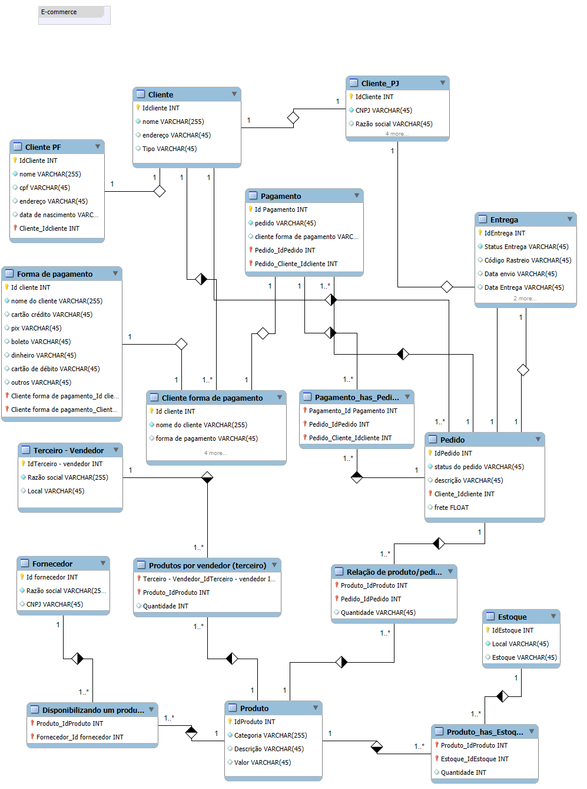

# E‑commerce — Modelo Conceitual do Banco de Dados

> **Contexto:** Este repositório guarda o diagrama e a descrição conceitual de um banco de dados para um **e‑commerce/marketplace**. O objetivo é representar, de forma clara, as entidades, atributos e relacionamentos que dão suporte a cadastro de clientes (PF/PJ), pedidos, pagamentos, produtos, estoque, fornecedores e vendedores terceiros, além do fluxo de entrega.

---

## 📌 Diagrama ER (conceitual)

O diagrama abaixo resume o modelo. Ele está em alta resolução no arquivo `e-commerce-refinado.png` (nesta mesma pasta).



---

## 🧭 Visão geral do domínio

- **Cliente**: entidade genérica que representa qualquer comprador. Sofre **especialização** em:
  - **Cliente PF** (pessoa física) — com `cpf` e `data de nascimento`.
  - **Cliente PJ** (pessoa jurídica) — com `cnpj`, `razão social` e `inscrições/contatos`.
- **Forma de pagamento**: catálogo com os meios aceitos (cartão, pix, boleto, débito, crédito, etc.).
  - **Cliente forma de pagamento**: relacionamento que registra os meios de pagamento **preferidos ou cadastrados** por cada cliente.
- **Pedido**: cabeçalho do pedido com `status`, `descrição` e `frete`, associado a um **Cliente**.
  - **Relação de produto/pedido** (itens do pedido): produtos e **quantidades** de cada pedido.
- **Pagamento**: lançamentos financeiros ligados a **Pedidos**.
  - **Pagamento_has_Pedido**: permite **1:N ou N:N**, suportando múltiplos pagamentos (parcelas, combos de meios) para o mesmo pedido.
- **Entrega**: informações logísticas por pedido (status, código de rastreio, datas de envio/entrega).
- **Produto**: catálogo de itens com `categoria`, `descrição` e `valor`.
  - **Estoque**: locais de estocagem (ex.: CD‑SP, CD‑RJ).  
  - **Produto_has_Estoque**: controla a **quantidade** de cada produto em cada local (modelo multi‑depósito).
- **Fornecedor**: empresas que abastecem o catálogo.
  - **Disponibilizando um produto**: vínculo entre **Fornecedor** e **Produto**.
- **Terceiro – Vendedor** (marketplace): lojistas que vendem dentro da plataforma.
  - **Produtos por vendedor (terceiro)**: produtos que cada vendedor oferece e a **quantidade** disponibilizada.

---

## 🔗 Cardinalidades e decisões de modelagem

- **Cliente ↔ PF/PJ**: especialização **1:1** (um cliente é exatamente PF *ou* PJ).  
- **Cliente ↔ Cliente forma de pagamento ↔ Forma de pagamento**: **N:N** via tabela associativa.
- **Pedido ↔ Cliente**: **N:1** (muitos pedidos para um cliente).  
- **Pedido ↔ Itens (Relação de produto/pedido) ↔ Produto**: **N:N** via itens, com atributo `quantidade` no relacionamento.  
- **Pedido ↔ Pagamento**: suportado via **Pagamento_has_Pedido** para múltiplos pagamentos no mesmo pedido.  
- **Pedido ↔ Entrega**: **1:1** (um registro de logística por pedido).  
- **Produto ↔ Estoque**: **N:N** via **Produto_has_Estoque**, com `quantidade`.  
- **Produto ↔ Fornecedor**: **N:N** via **Disponibilizando um produto**.  
- **Produto ↔ Terceiro – Vendedor**: **N:N** via **Produtos por vendedor (terceiro)**, com `quantidade`.

---

## 🔑 Chaves e atributos (resumo)

- Todas as entidades possuem um **id** inteiro como chave primária (`IdCliente`, `IdPedido`, `IdProduto`, etc.).  
- Relacionamentos associativos trazem as respectivas **chaves estrangeiras** (ex.: `Produto_IdProduto`, `Pedido_IdPedido`) e, quando aplicável, atributos próprios como `quantidade`.  
- Atributos de domínio seguem o diagrama: `status`, `descrição`, `endereço`, `valor`, `local`, códigos de rastreio, etc.

---

## 🧪 Como validar o modelo

- Verifique as **integridades referenciais** (FKs) conforme indicado nas ligações do diagrama.  
- Garanta as regras de **cardinalidade** ao gerar o modelo lógico/DDL (ex.: tabelas associativas para N:N).  
- Para análise de performance posterior, índices podem ser considerados em FKs e colunas de busca.

---

## 📂 Estrutura do repositório

```
.
├── README.md                 # Este arquivo (descrição conceitual)
└── e-commerce-refinado.png   # Diagrama ER em alta resolução
```

---

## 📝 Observações

- A nomenclatura das entidades e atributos está **em português**, respeitando o diagrama.  
- Este modelo conceitual é um ponto de partida para derivar o **modelo lógico** (DDL SQL) conforme o SGBD escolhido.
